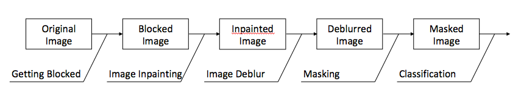
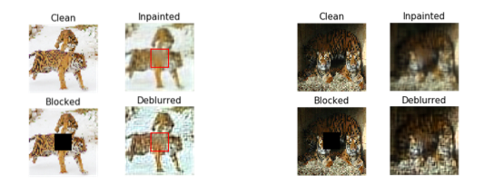

# Image-Inpainting-and-Classification

This project focuses on solving the classifying problem with blocked part. Mean process of the project includes image inpainting, image deblurring and image classifying. The mean tool we implemented is convolution neural network such as VGG16. The goal of this project was to try different convolution network to im- prove our image quality to improve classifying ability of our origin classifying model. As a result, our model can do great inpainting on a series of feline image data and improved classifying accuracy about 10% compared to image with block, almost reach the accuracy of the original images.

